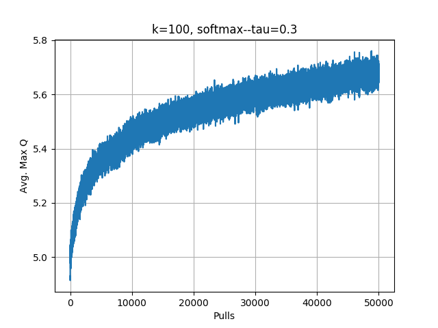

### HW 5: RLDM - CS 7642 - mmendiola3

{#id .class width=50%}
{#id .class width=50%}
{#id .class width=50%}
{#id .class width=50%}
{#id .class width=50%}
{#id .class width=50%}
{#id .class width=50%}
{#id .class width=50%}
