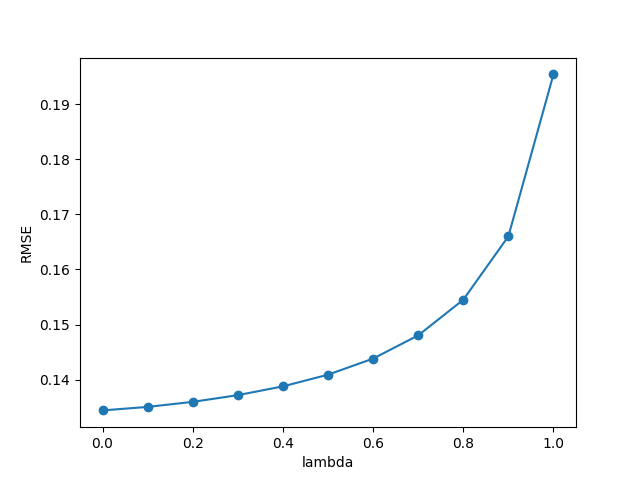
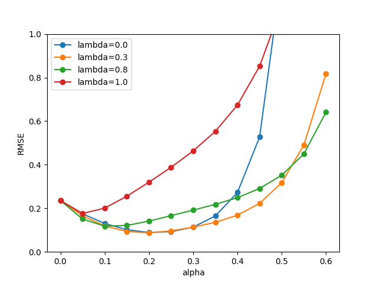
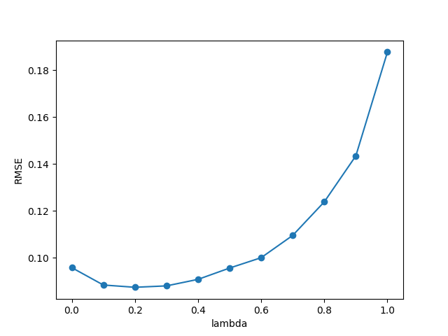

Project 1: RLDM - CS 7642
=====================================

GID: mmendiola3

Presentation: [https://youtu.be/aCK4pTkULUQ](https://youtu.be/aCK4pTkULUQ)

## Overview

We will review and replicate the experiments presented in Sutton's 1988 paper, "Learning to Predict by the Methods of Temporal Differences". I will highlight required assumptions for parameters not explicitly stated, and compare and contrast the methodology and results of Sutton's work to this one. Finally, we will review the challenges faced in recreating Sutton's original experiments and how these were handled.

## Random Walk Experiment

### Generating Sequences
I wrote a function that generates a sequence of $x_i$ vectors in the same way as Sutton (e.g. [0,0,1,0,0] for state D). Each sequence ended in either a 1 or 0 depending on the terminating state. The following is an example sequence of D, E, F, G: [(0,0,1,0,0), (0,0,0,1,0), (0,0,0,0,1), 1]. 100 training sets of 10 random walk sequences were generated using this function. These sequences acted as the training data for each experiment.

### Error Measure
Each experiment measured the accuracy of the algorithm to predict the probabilities of right-side termination at each of the five states. The RMS error was calculated as $sqrt(mean(square(predicted\_weights - actual\_weights)))$, with actual weights of (1/6, 2/6, 3/6, 4/6, 5/6). Error was averaged over repeated experiments on 100 state sequences.

### Weight Updates
Both experiments used Sutton's $\Delta w_t$ update equation from (4), $\Delta w_t = \alpha (P_{t+1} - P_t) \sum_{k=1}^t \lambda^{t-k} \nabla_w P_k$. The code uses an eligibility vector to keep track of the exponential weighting with recency. This method of incremental computation is shown in Sutton's paper as $e_{t+1} = \nabla_w P_{t+1} + \lambda e_t$. In code, this is accomplished with $e = e + x_{t-1}$ before the weight update, and $e = \lambda e$ after. Each state's prediction value is calculated as $P_t = w^T x_t$, except for the terminal state, which is given the scalar value 0 or 1. The resulting $\Delta w_t$ update equation in code is $\Delta w_t = \alpha (P_{t+1} - P_t) e$.

## Batch TD($\lambda$)

### Repeated Presentation
For the first experiment, each $\Delta w_t$ was accumulated into a single running $\Delta w$ vector. At the end of all episodes, $\Delta_w$ was added to the weight vector, then reset for the next round of training. These training sets were presented repeatedly until the change in w reached a given threshold. Sutton's paper did not provide an explicit stopping criteria; For this experiment, training ended when $|\Delta w|_2$ fell below 1e-7. By that point, changes in error from actual weights are negligable. 

### Best $\alpha$
Sutton mentions using the best $\alpha$ to show error accross various lambda values in his Figure 3. This seems to be contridicted in a later statement, "For small $\alpha$, the weight vector always converged in this way, and always to the same final value." This implies that as long as $\alpha$ is small enough, the resulting error for a given lambda will be the same. Through experimentation, I discovered this to be accurate. While larger $\alpha$ reduced time to convergence, too large of an $\alpha$ caused the weight vector to diverge. Figure \ref{fig3} was constructed by running the average of 100 sequences of 10 on the batch TD algorithm for lambda values from 0 to 1, using an $\alpha$ of 0.005.

### Results
{#id .class width=60%}

Interestingly, Figure \ref{fig3} resembles a combination of Sutton's original Figure 3 and the one in his Erratum. The results here are monotonically increasing (like Erratum), but resemble the scale from the original figure. I am not able to attribute the scale difference between Figure \ref{fig3} and the Erratum figure to any particular parameter. Especially given Sutton's assertion that the weight vector would always converge to the same final value.

## Online TD($\lambda$)

{#id .class width=50%}
{#id .class width=50%}

### Sequential Weight Updates
The second experiment does a single passthrough of the 10 sequences, and updates the weight vector after each state sequence. This removes the need to monitor the process of convergence, and greatly reduces the number of weight update calculations.

### Results
The left-hand figure reproduces the result from Sutton's Figure 4. In this plot, we measure the error given various $\lambda$ and $\alpha$ values. The general scale, and relationship between $\lambda$ values, are similar to Sutton's result. A few exceptions include $\lambda = 0$, where error after $\alpha = 0.4$ increase at a much higher rate. Also, $\lambda = 0.3$ and $\lambda = 0.8$ crossover after $\alpha = 0.5$. These results still support Sutton's assertion that testing error (not training error) is highest with $\lambda = 1$ (Widrow-Hoff) for various values of $\alpha$.

The right-hand plot shows that, given the optimal $\alpha$ for each value of $\lambda$, the optimal value of $\lambda$ is still an intermediate value between 0 and 1. This plot matches Sutton's Figure 5. Optimal $\alpha$ values for each lambda were obtained by iterating through each value of $\alpha$ from 0.05 to 0.55 to find the value that minimized error for that particular value of $\lambda$. With this result, we affirm Sutton's assertion that $\lambda = 0$ is not optimal in this case because of the latency in propogating values between states.
