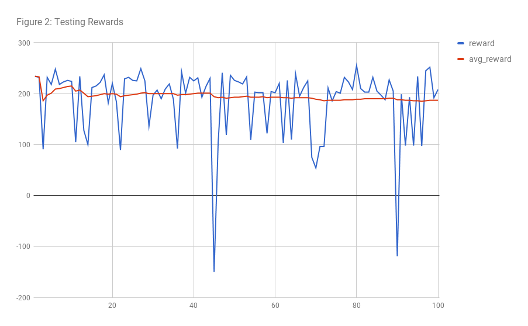
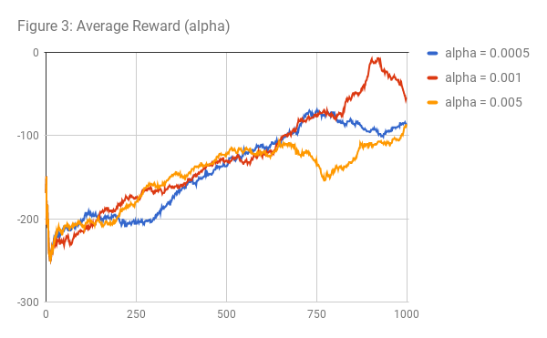
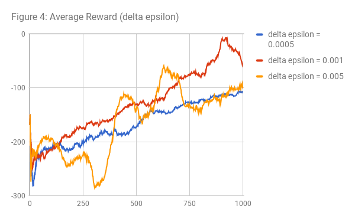

Project 2: RLDM - CS 7642
=====================================

GID: mmendiola3

Presentation: [https://youtu.be/DgZeUsTMDkk](https://youtu.be/DgZeUsTMDkk)

## Overview

This paper will review an RL agent designed to solve the LunarLander-v2 problem. We will review the algorithms and hyper-parameters chosen and present how these decisions affected performance of the agent. We will also address the pitfalls and lessons learned while constructing the RL agent.

## Agent Design

The base algorithm used by the agent is Q-learning, with a neural network for function approximation. My initial thought was to descretize the state space to allow for a simple Q table implementation. This was quickly abandoned in favor of the more generalized, and adaptable, function approximation.

Q value function approximation works by calculating $Q(s, a) = reward + \gamma argmax(Q(s', a))$ from experience and submitting (s, Qs) pairs to the neural network for training. Q(s', a) values are obtained from the neural network, as well as Q(s) values for choosing agent actions.

### Neural Network
DQN (Deep Q Network) refers to a Q-learning agent with a neural network for learning and predicting Q values at given (state, action) pairs. The 'Deep" part refers to a network with many hidden layers (including convolutions), as was used in the original Deep Mind research. The agent used to solve LunarLander uses a single hidden dense layer with 400 nodes. This was enough to approximate Q values for this environment without requiring longer training times on a more complex network. This agent could then be considered a simple QN.

**Layers** --
I tested many combinations of layers and nodes to find the simplest network capable of approximating Q values with enough granularity to guide the lander towards the goal. I tested single hidden layers with nodes between 16 and 1024 and two hidden layer networks with the second layer either equal or half that of the fist layer. Each of these experiments resulted in worse or similar initial performance or increased training time.

**Activation, Loss, and Optimizer** --
Neural network nodes require an activation function to map inputs to outputs. A common function used in DQN is ReLU (x for x $\geq$ 0 else 0) in hidden nodes. I encountered a problem with weights no longer updating in certain nodes (dead nodes), and found that LeakyReLU (x for x $\geq$ 0 else 0.01x) allowed the network to recover in those situations. The loss function for Q networks are usually MSE, but I noticed occasionally high errors depending on changing terrain. To make the agent robust to these outliers, I used a pseudo-huber loss function to reduce the effect of high error terms. SGD (Stocastic Gradient Descent) was originally used, and later changed to Adam in an attempt to break out of what seemed to be a local minima. Adam has more sophisticated heuristics for choosing gradient direction. Adam is a common choice in Q learning neural networks, and empirically, it did improve the agents learning curve.

### Updates
I tested a variety of update strategies, all of them included experience replay. This is process of storing (s, a, s', r, done) tuples and running model training on batches from memory. This prevents the model from learning from just the most recent (highly correlated) experiences. Memory size was adjusted as a hyper-parameter and finally set at 5e5. Batch sizes where adjusted from 16 to 512 (final at 256). Batch sizes were changed based on training frequency. Testing was done on training after a set number of episodes (1 to 100) and set number of steps (1 to 1000). The right balance seemed to be to run a batch of 256 every 500 steps.

### Epsilon Strategy
Agent actions were chosen based on Q values with a probability of $1 - \epsilon$ and randomly chosen (uniform) otherwise. $\epsilon$ was then adjusted based on different strategies. I tested decay strategies including geometric, linear, tiered linear (min values based on current avg reward), VDBE (Adaptive epsilon-greedy strategy based on value differences), and Contextual-Epsilon-greedy (based on current avg reward). The adaptive and contextual decay strategies were abandoned as they added additional complexity without apparent performance improvements. A linear strategy with $\Delta \epsilon = 0.001$ as a hyper-parameter was used for the final agent. Results from the $\epsilon$ decay experiments latter show that these advanced strategies are worth exploring further.

### DQN Improvements
I attempted a number of modified Q network strategies such as a separate network for stabilizing target values (double DQN); separate networks for values and action advantages (Dueling DQN), and prioritizing experience replay based on TD error (PER). These were all eventually abandoned either due to increased training runtimes, or insignificant performance improvements. Unfortunately, there isn't enough space to cover each of these learning experiences individually or in any depth. Examples of these implementations are available in the code repository under the improvements directory.

## Results

{#id .class width=50%}
{#id .class width=50%}

Figure 1 shows the results of training the agent until average reward reaches 200. This took just over 5,000 episodes. Some experimental agents reached 150 average after far fewer episodes (around 500), but their runtimes were prohibitively slower. This included an agent with a non-optimized implementation of PER.

Figure 2 shows the results of testing the final model and weights with no exploration ($\epsilon = 0$). There is still some variance in the agents ability, which led me to explore ways of refining weights further with additional, and slightly modified, training. One trial involved resetting initial $\epsilon$ to around 0.2 and resuming training with a higher average reward target. This improved the agent's performance slightly.

## Hyper-Parameter Experiments
I tested various changes to hyper-parameters, including higher and lower learning rates on the neural net optimizer ($\alpha$) and $\Delta \epsilon$. Additional testing was performed on batch sizes, training frequency, history size, and discount rate. The presented results only cover $\alpha$ and $\Delta \epsilon$ to conserve space.

{#id .class width=50%}
{#id .class width=50%}

Figure 3 shows learning rates greater and less than the final value, which is also the keras Adam implementation default (0.001). Agent performance over training episodes is somewhat similar. There's some indication of more conservative growth with the lower rate around episode 250, but the agent catches up soon thereafter. Starting at episode 600, we see some divergence with the higher alpha probably struggling to find a narrow gradient for improvement. The low alpha agent again shows that it is robust to local minima, but will not achieve large leaps in weight improvements. The end result of these three agents is that the low alpha agent reaches a 200 average 20% further than the default. The high alpha agent did not converge after 10,000 episodes of training.

Figure 4 shows $\epsilon$ decay rates greater and less than optimal. It's clear in this figure that decaying $\epsilon$ too quickly causes the agent to struggle in finding the optimal Q values that work in general. The agent eventually experiences these edge states through the stochastic nature of the environment, but the learning curve is retarded by the network weights making large, and abrupt, changes. Slower $\epsilon$ decay shows a predictably stable learning pattern. However, it does not fully exploit it's learned Q values. These results indicate that significant improvement should be possible with a well implemented Contextual-Epsilon-greedy strategy; Perhaps by making epsilon decay adaptive based on reward volatility or momentum.
