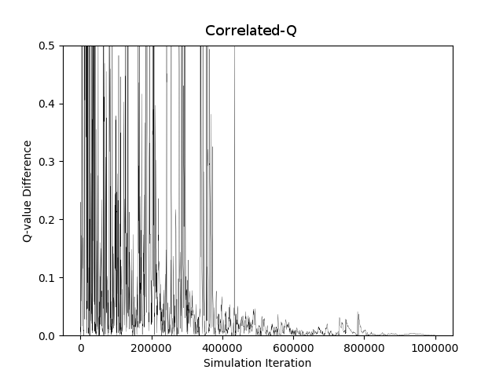
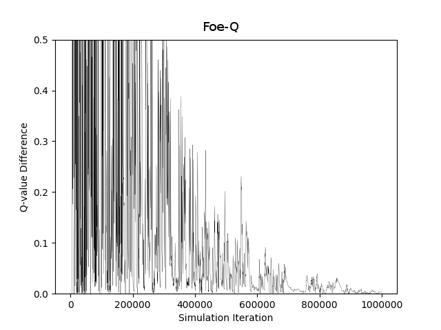
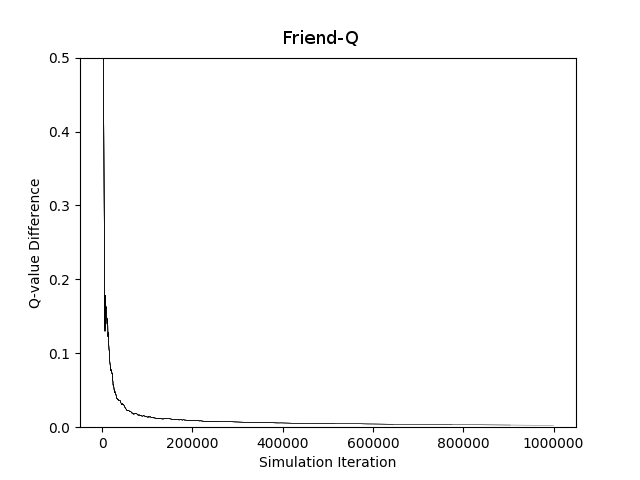
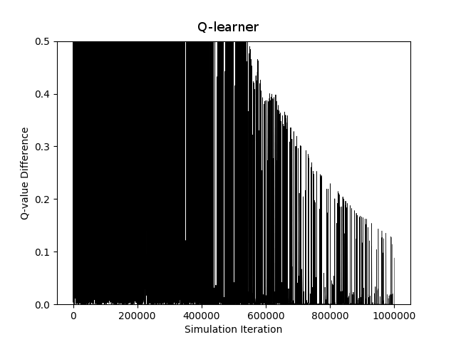

Project 3: RLDM - CS 7642
=====================================

GID: mmendiola3

Presentation: [https://youtu.be/](https://youtu.be/)

## Overview

This paper will review the reproduction of experiments done in "Correlated Q-Learning" [@Greenwald:2003:CL:3041838.3041869]. We will explore the agents designed to learn policies for the multi-agent soccer environment outlined in the original paper, and compare the result. Finally, we will discuss the challenges and assumptions made in order to reproduce the graphs in Figure 3.

## Soccer Environment
The soccer experiment rules were reproduced with a basic environment class built with an interface similar to those in OpenAI gym environments. It maintains state and models the actions and rewards outlined in the original paper. Experiments with various agents are able to make calls to env.step(actions) and receive back next state, rewards, and the done flag. Actions, state, and rewards includes data on both players in the soccer environment.

## Experiment Setup
Using the soccer environment model, experiments were run with four learning agents (uCE-Q, Foe-Q, Friend-Q, and Q-learning). Each experiment was run over 10e5 steps (env steps, not episodes). The change in Q values for a specific player, state, and action(s) was recorded over these trials. This state is illustrated in Figure 4 of the original paper and the action(s) were: A=South, B=Stick. Points are plotted only on steps where this state, action(s) pair is observed, which is the first of many details left out of the original paper.

## Agents
Each learning agent used discount factor $\gamma$ of 0.9. They all used the same update procedure in Table 1 of [@Greenwald:2003:CL:3041838.3041869], including the Q value update formula. Each agent provided their own value function for $V_i(s')$.

### Q-Learner
The Q-learning experiment used two separate agents and Q tables for each player. The value update function was $V^*(s) = \underset{a \in A(s)}{\mathrm{max}} Q^*(s, a)$, which is simply the max Q value in a given state across all actions. In Q-learning, the agents only track Q values for their own actions.

Initial $\alpha$ was set to 0.3, and decayed exponentially with a decay factor of $10^{log(0.001)/5e6}$. The decay factor was inspired by [@littman01a] and both of these hyper-parameters required experimentation to find appropriate values. [@Greenwald:2003:CL:3041838.3041869] only specifies that $\alpha$ should decay to a minimum value of 0.001. The same decay schedule was used on $\epsilon$. The Q-learning agent was the only one run on-policy, with $\epsilon$-greedy actions. All other agents choose actions at random.

### Multi-Agent Learners
Foe-Q, Friend-Q, and CE-Q all used an initial $\alpha$ of 1.0. Friend-Q used a decay schedule explained in [@greenwald2005correlated] as $\alpha = 1 / n(s,a)$. All other agents used the same exponential decay as Q-learning, with a decay rate of $10^{log(0.001)/4e6}$.

**Foe-Q** --
Foe-Q's value function was $V_i(s) = \underset{\sigma_1 \in \sum_1(s)}{\mathrm{max}} \underset{a_1 \in A_2(s)}{\mathrm{min}} \sum_{a_1 \in A_1} \sigma_1(a_1)Q(s, a_1, a_2)$. Linear programming was used to find this value with 

## Results

{#id .class width=25%}
{#id .class width=25%}
{#id .class width=25%}
{#id .class width=25%}

## References
